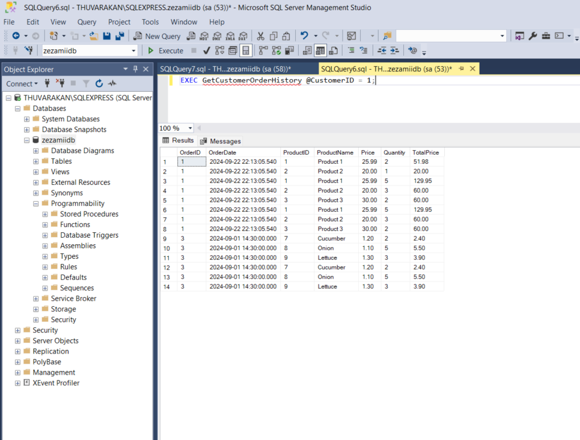
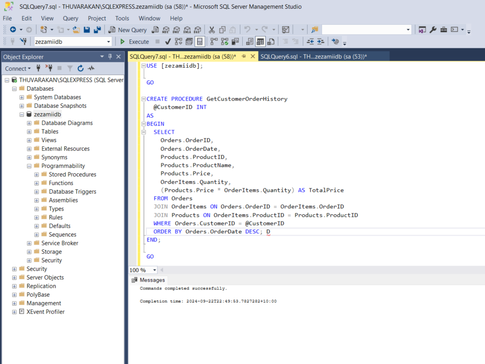

## zezamii_assessment

# Task 1: Backend Development with Node.js and Express

- npm install
- npm srart

  1. Get All Users

  - **Method**: `GET`
  - **Endpoint**: `http://localhost:3002/users`
  - **Description**: Fetch a list of all users.

  2. Get a User by ID

  - **Method**: `GET`
  - **Endpoint**: `http://localhost:3002/users/:id`
  - **Description**: Fetch a user by their ID.
  - **Example**: `http://localhost:3002/users/1`

  3. Create a New User

  - **Method**: `POST`
  - **Endpoint**: `http://localhost:3002/users`
  - **Description**: Create a new user.
  - **Body**:

  ```json
  {
    "name": "John Doe",
    "email": "john@example.com"
  }
  ```

  3. Create a New User

  - **Method**: `PUT`
  - **Endpoint**: `http://localhost:3002/users/1`
  - **Description**: Update user.
  - **Body**:

  ```json
  {
    "name": "John Doe",
    "email": "john@example.com"
  }
  ```

# Task 2: Database Management with MSSQL

- mpn install
- npm start

  1. Get Products List Not Ordered in the Last 30 Days

  - **Method**: `GET`
  - **Endpoint**: `http://localhost:3003/db/products-list`
  - **Description**: Fetch a list of products that have not been ordered in the last 30 days.

  1. Get all orders and their associated customer details.

  - **Method**: `GET`
  - **Endpoint**: `http://localhost:3003/db/orders-with-customers`
  - **Description**: Fetch a all orders and their associated customer details..

  2. Get Customer Order History

  - **Method**: `GET`
  - **Endpoint**: `http://localhost:3003/db/order-history/:customerID`
  - **Description**: Fetch the order history for a specific customer.
  - **Example**: `http://localhost:3003/db/order-history/1`

  3. Insert Dummy Data

  - **Method**: `POST`
  - **Endpoint**: `http://localhost:3003/insert`
  - **Description**: Insert dummy data into the database for testing purposes.

  4. Update Product Price

  - **Method**: `PUT`
  - **Endpoint**: `http://localhost:3003/db/update-price`
  - **Description**: Update the price of a specific product.
  - **Body**:

  ```json
  {
    "productID": 1,
    "newPrice": 15.0
  }
  ```

  5. I have successfully created the stored procedures using SQL Server Management Studio and uploaded photos for testing.
     To facilitate this, I've developed a separate API that allows for easy testing through Postman
     , 

## Task 3: Frontend Development with React.js

- npm install
- npm start

  ## Overview

  This application allows users to view and filter a list of products fetched from a mock API.
  It is developed using React.js and features real-time search functionality.

  ## Features

  1. **Display Data**:

  - Fetches and displays a list of products from the [Dummy JSON Products API](https://dummyjson.com/docs/products).
  - Each product shows its name, price, and description.

  2. **State Management**:

  - Users can filter products by name using a search bar.
  - The product list updates in real-time as the user types in the search bar.

  3. **Access**:

  - http://zezamiiassessment.thuvarakan.info
